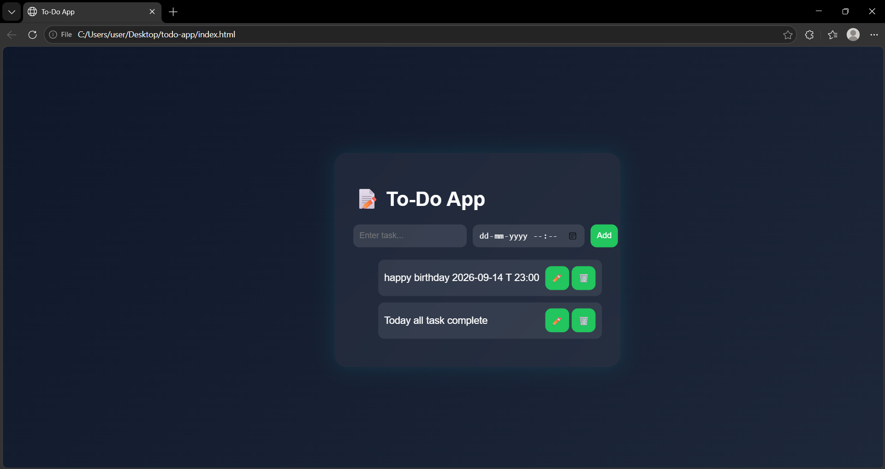

# 📝 To-Do Web Application

A modern and interactive **To-Do List Web App** built using **HTML, CSS, and JavaScript** as part of my internship at **SkillCraft Technology**.

---

## 🚀 Live Demo

🔗 https://pawanpushkar.github.io/SCT_WD_4/

---

## 📸 Preview



---

## ✨ Features

* ➕ Add new tasks
* 🗂️ Organize tasks with date & time
* ✅ Mark tasks as completed
* ✏️ Edit existing tasks
* 🗑️ Delete tasks
* 🎨 Glassmorphism UI with modern design

---

## 🛠️ Tech Stack

* HTML5
* CSS3
* JavaScript (Vanilla JS)

---

## 📂 Project Structure

```id="2by4hp"
SCT_WD_4/
│
├── index.html
├── style.css
├── script.js
├── output.png
└── README.md
```

---

## ⚙️ How to Run Locally

1. Clone the repository

```id="0y49mr"
git clone https://github.com/pawanpushkar/SCT_WD_4.git
```

2. Open the project folder

```id="ntz03a"
cd SCT_WD_4
```

3. Run the app

* Open `index.html` in your browser
  OR
* Use **Live Server (VS Code Extension)** for better experience

---

## 🌐 Deployment

This project is deployed using **GitHub Pages**.

To deploy your own:

1. Push code to GitHub
2. Go to **Settings → Pages**
3. Select branch: `main`
4. Save

Your app will be live 🎉

---

## 🧠 Key Concepts Used

* DOM Manipulation
* Event Handling
* CRUD Operations (Create, Read, Update, Delete)
* Dynamic UI Updates

---

## 📌 Internship Task

This project was developed as part of a **Web Development Internship at SkillCraft Technology**, demonstrating practical implementation of JavaScript-based applications.

---

## 🤝 Contributing

Feel free to fork and improve this project 🚀

---


## 📄 License

This project is open-source and free to use.
---

## Author 
**Pawan Pushkar**

